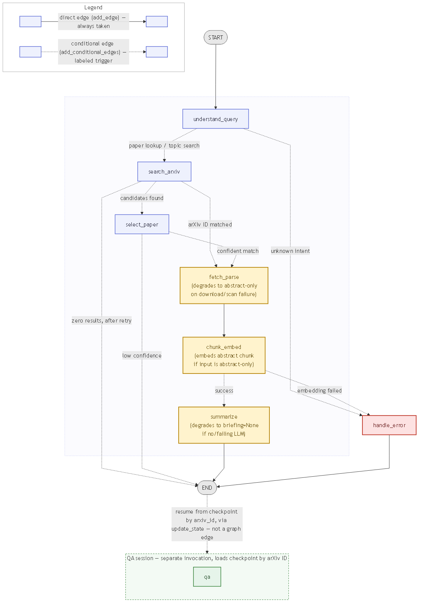
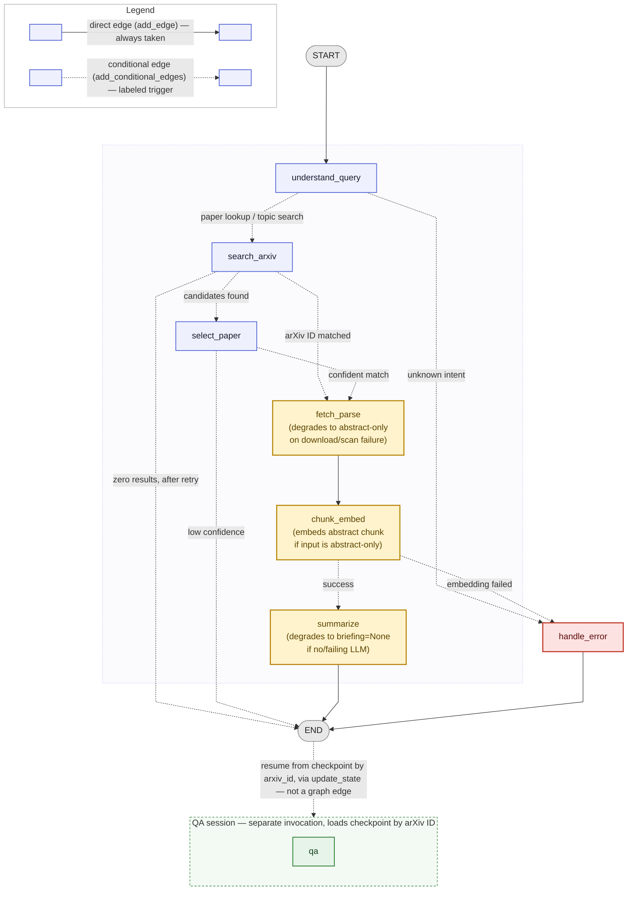

# arXiv Digest Agent

An autonomous agent that turns a research topic or an arXiv paper ID into a structured executive briefing, then answers follow-up questions about that paper with citations grounded in the actual text. It runs as an explicit [LangGraph](https://github.com/langchain-ai/langgraph) state graph — not a single prompt chain — so each stage (query understanding, retrieval, ranking, parsing, chunking/embedding, summarization, QA) is a separate, testable node with typed shared state. It is built to run entirely on free-tier tools: no paid API key is required, and the agent degrades to parsing + retrieval + extractive QA if no LLM key is configured at all.

> **Video reflection:** https://youtu.be/tpq7zpCiTNQ?si=G5z0a8hAryDaVW4u

---

## Features

Mapped to the assessment's required capabilities:

| Requirement | Where it lives |
|---|---|
| Topic search **or** specific arXiv ID/URL as input | `understand_query` node — [`nodes/understand_query.py`](src/arxiv_agent/nodes/understand_query.py) |
| arXiv metadata retrieval (title, authors, abstract, PDF link, categories, date) | `search_arxiv` node — [`services/arxiv_client.py`](src/arxiv_agent/services/arxiv_client.py) |
| Selection/ranking of the most relevant paper | `select_paper` node — embedding rank + LLM re-rank — [`services/ranker.py`](src/arxiv_agent/services/ranker.py) |
| PDF fetch & parse (sections, abstract, references) | `fetch_parse` node — PyMuPDF primary, pdfplumber fallback — [`services/pdf_parser.py`](src/arxiv_agent/services/pdf_parser.py) |
| Chunk & embed into a local vector DB | `chunk_embed` node — sentence-transformers + Chroma — [`services/chunker.py`](src/arxiv_agent/services/chunker.py), [`services/vectorstore.py`](src/arxiv_agent/services/vectorstore.py) |
| Structured executive briefing | `summarize` node + `Briefing` schema — [`schemas.py`](src/arxiv_agent/schemas.py) |
| Grounded QA over the paper (RAG), with explicit refusal | `qa` node — [`nodes/qa.py`](src/arxiv_agent/nodes/qa.py) |
| Explicit stateful graph (nodes + edges + shared state) | [`graph.py`](src/arxiv_agent/graph.py), [`state.py`](src/arxiv_agent/state.py) |
| At least one realistic failure case handled gracefully | Zero/many arXiv results, scanned/oversized PDFs, missing LLM key — see [Conditional edges](#conditional-edges--failure-handling) |
| State persists between summarization and QA | SQLite checkpoint + on-disk Chroma, keyed by arXiv ID — see [State persistence](#state-persistence) |
| Runs with no paid API key | `LLM_PROVIDER=none` → `NullLLM`; parsing/retrieval/extractive QA still work |

---

## Quickstart

Pick the block that matches your OS/tooling and run its commands **in order, top to bottom**. Each block is self-contained through the `.env` copy step; then jump to [4. Run it](#4-run-it), which is the same for everyone.

### macOS / Linux (`pip` + `venv`)

```bash
# 1. Clone and enter the repo
git clone <your-repo-url>
cd arxiv-digest-agent

# 2. Create a virtual environment and install
python -m venv .venv
source .venv/bin/activate
pip install -r requirements.txt
pip install -e .

# 3. Configure your .env
cp .env.example .env
```

### Windows — PowerShell (`pip` + `venv`, used to build this repo)

```powershell
# 1. Clone and enter the repo
git clone <your-repo-url>
cd arxiv-digest-agent

# 2. Create a virtual environment and install
python -m venv .venv
.venv\Scripts\Activate.ps1
pip install -r requirements.txt
pip install -e .

# 3. Configure your .env
copy .env.example .env
```

### Windows — Command Prompt (`pip` + `venv`)

```bat
:: 1. Clone and enter the repo
git clone <your-repo-url>
cd arxiv-digest-agent

:: 2. Create a virtual environment and install
python -m venv .venv
.venv\Scripts\activate.bat
pip install -r requirements.txt
pip install -e .

:: 3. Configure your .env
copy .env.example .env
```

### Any OS — `uv` (no manual activation step)

```bash
# 1. Clone and enter the repo
git clone <your-repo-url>
cd arxiv-digest-agent

# 2. Create a virtual environment and install
uv venv
uv pip install -r requirements.txt
uv pip install -e .

# 3. Configure your .env
cp .env.example .env
# Windows (PowerShell or cmd): copy .env.example .env
```

Edit `.env` and set at least one of the following (or leave `LLM_PROVIDER=none` to run without any LLM at all — parsing, retrieval, and extractive QA still work, but summarization and full grounded QA need a provider):

```env
LLM_PROVIDER=gemini          # gemini | groq | none
GEMINI_API_KEY=your-key-here
LLM_MODEL=gemini-3.6-flash
```

> `LLM_MODEL` is a single shared field for whichever provider you pick — if you switch to `LLM_PROVIDER=groq`, also change `LLM_MODEL` to a Groq model name (e.g. `llama-3.3-70b-versatile`); the default only matches Gemini.

### 4. Run it

```bash
arxiv-agent digest "recent work on KV-cache compression for LLMs"
# or
arxiv-agent digest 1706.03762
```

This fetches/selects a paper, parses it, builds the vector index, prints a structured briefing, saves it to `data/outputs/{arxiv_id}.{md,json}`, and drops into an interactive QA session. Resume QA on an already-digested paper later with:

```bash
arxiv-agent qa 1706.03762
```

Other commands: `arxiv-agent info` (resolved config + cache sizes), `arxiv-agent clear-cache` (wipe PDFs/embeddings/checkpoints/LLM cache).

To see the no-LLM-key degraded path without touching `.env`, run any paper through `--provider none` (verified live on 2026-09-19 — see `docs/decisions.md`):

```bash
arxiv-agent digest 1409.0473 --provider none
```

This still fetches, parses, chunks, and embeds the paper, but prints "No briefing was generated ... Note: No LLM API key is configured" instead of a briefing — summarization has no substitute for an LLM. QA is different: asking a question that clears the similarity floor doesn't refuse — `nodes/qa.py` detects `NullLLM` by name and, instead of a guaranteed `LLMError`, returns the top retrieved passages verbatim under a `"No LLM configured — showing the most relevant passages from the paper."` header, with `/sources` populated from those same passages. A question that matches nothing in the paper still gets the ordinary pre-LLM refusal ("I couldn't find that in this paper."), same as with a real provider. This is exactly the degraded mode the assessment's "no paid API key required" constraint asks for.

Once a briefing prints, you're dropped into an interactive QA session for that paper. Try one question the model can answer from the text, and one it should refuse:

```
> What optimizer did the authors use for training?
```
Answered — grounded citation from the real `5.3 Optimizer` section, including the exact learning-rate formula.

```
> How does the Transformer compare to GPT-4 on reasoning benchmarks?
```
Refused (`NOT_IN_PAPER`) — the 2017 paper predates GPT-4, so nothing in the text supports an answer.

### Getting a free API key

- **Gemini (Google AI Studio):** https://aistudio.google.com/app/apikey — free tier, no card required as of this writing.
- **Groq:** https://console.groq.com/keys — free tier, no card required.

### Free-tier rate limits (verified 2026-09-19)

| Provider | Model used here | RPM | RPD | Notes |
|---|---|---|---|---|
| Gemini | `gemini-3.6-flash` | **5** | **20** | 1M-token context window; quota resets at midnight Pacific. Applies per Google Cloud project, not per key. **Both figures directly observed** from live `429 RESOURCE_EXHAUSTED` responses while working with this project against a real key: the RPM figure from a `quotaValue: '5'` violation (`GenerateRequestsPerMinutePerProjectPerModel-FreeTier`), and the daily figure from a separate `quotaValue: '20'` violation (`GenerateRequestsPerDayPerProjectPerModel-FreeTier`) hit after a normal afternoon of testing — **20 requests/day is easy to exhaust with a handful of `digest` runs plus QA questions**, budget testing accordingly. Third-party sources (and `ai.google.dev/gemini-api/docs/rate-limits`, which lags new model releases) still widely cite ~15 RPM/~1,500 RPD, but those figures are for the now-retired `gemini-2.0-flash`. |
| Groq | e.g. `llama-3.3-70b-versatile` | 30 | 1,000 (model-dependent, up to 14,400 for smaller models) | Also capped by tokens/minute and tokens/day — whichever ceiling you hit first throttles you. Applies per organization, not per key. Not directly exercised in this session (no Groq key available); source: [console.groq.com/docs/rate-limits](https://console.groq.com/docs/rate-limits) |

Both change without notice, and Google has already retired at least one model (`gemini-2.0-flash` → `gemini-3.6-flash`) during this project's build window — re-check the linked pages, and expect to update `LLM_MODEL` again later. The agent enforces its own client-side cap (`LLM_REQUESTS_PER_MINUTE`, **default 5**, matching the observed Gemini ceiling above) with a token-bucket limiter that now sits *inside* the retry wrapper, so every real HTTP attempt — including retries after a transient error — consumes a token instead of letting retries silently exceed the provider's real per-minute quota (a bug found and fixed while capturing this README's live examples; see `docs/decisions.md`). Retries themselves use exponential backoff (1s/2s/4s).

**Approximate LLM calls for one full run** (each call is one request against the RPM/RPD budget above):

| Scenario | `understand_query` | `select_paper` | `summarize` | Calls before QA | + per question |
|---|---|---|---|---|---|
| arXiv ID directly, single-pass summary | 0 (ID matched, no LLM) | 0 (no ranking needed) | 1 | **1** | +1 |
| arXiv ID directly, long paper (map-reduce) | 0 | 0 | up to 6 (5 section-map calls + 1 reduce) | **up to 6** | +1 |
| Topic search, single-pass summary | 1 (query rewrite) | 1 (re-rank top 5) | 1 | **3** | +1 |
| Topic search, long paper (map-reduce) | 1 | 1 | up to 6 | **up to 8** | +1 |

A refused QA question (nothing clears the similarity floor) costs **0** LLM calls — the pre-LLM guard short-circuits before any request is made.

---

## Architecture

### Graph diagram



`docs/graph.mmd` is **hand-maintained**, not auto-exported from `graph.py` — see the drift-risk note in [`docs/decisions.md`](docs/decisions.md). Edge style follows the LangGraph API each edge was actually registered with: solid/unlabeled = `add_edge` (always taken), dotted/labeled = `add_conditional_edges` (the label names the real trigger read from `graph.py`'s routing functions).

<details>
<summary>Mermaid source (fallback if the PNG doesn't render — <a href="docs/graph.mmd">docs/graph.mmd</a>)</summary>


</details>

The main sequence is drawn inside its own (unlabeled, dashed-border) cluster on purpose: `handle_error` and `END` are each reached from nodes at very different points in the sequence (e.g. `understand_query` near the top and `chunk_embed` near the bottom both route to `handle_error`), and clustering the sequence forces the layout to route those long cross-cluster edges around the outside of the pipeline instead of sweeping across unrelated nodes in the middle of it.

The `understand_query → search_arxiv` edge is labeled **"paper lookup / topic search"** rather than a vaguer "recognized intent" — but it is genuinely one edge, not two: `_route_after_understand_query` in `graph.py` only ever returns `"handle_error"` or `"search_arxiv"`; both the `PAPER_LOOKUP` and `TOPIC_SEARCH` intents route to the same `search_arxiv` node, so there's no second, distinctly-routed edge to draw here without inventing one that isn't in the code. The actual ID-vs-topic behavioral split happens *inside* `search_arxiv` (`_lookup` vs. `_topic_search`), one node downstream of this edge, not at the graph-routing level.

`qa` is drawn inside its own **"QA session"** subgraph, reached by a dotted edge from `END` labeled *"resume from checkpoint by arxiv_id, via update_state — not a graph edge"*: this is a deliberate design choice, not an orphan node. The compiled graph's only real path is `understand_query → ... → summarize → END`; `qa` has no incoming edge in the actual `StateGraph` because the CLI re-enters an already-summarized session by calling `nodes.qa.answer_question(...)` directly and persisting the turn with `compiled_graph.update_state(...)` against the paper's checkpointed thread — see [State persistence](#state-persistence).

**Note on `fetch_parse → chunk_embed`:** this edge is solid/unconditional, not a typo. There is no separate "total parse failure → skip embedding, summarize directly in abstract-only mode" branch in `graph.py` — `fetch_parse` never raises (it already degrades to an abstract-only `ParsedPaper` internally on download failure or a near-zero-quality/scanned PDF), and `chunk_embed` already knows how to embed that degraded case (a single synthetic abstract chunk, `degraded_retrieval=True`) rather than needing the graph to route around it. This is a deliberate decision, not a gap — see the "`fetch_parse → chunk_embed` is a straight edge, not conditional" entry in [`docs/decisions.md`](docs/decisions.md).

### Node-by-node

| Node | Reads from state | Writes to state | Failure behaviour |
|---|---|---|---|
| `understand_query` | `raw_input` | `intent`, `search_query` | Empty input → `intent=UNKNOWN`. LLM topic-rewrite failure falls back to a deterministic stopword-stripping rewrite (never blocks). |
| `search_arxiv` | `intent`, `search_query` | `selected` (ID lookup) or `candidates`, `warnings`, `needs_ranking` (topic search) | Unknown ID → routes to rephrase. Zero topic results → one broadened retry, then `next_action="ask_user_to_rephrase"` and ends the graph (no crash). |
| `select_paper` | `candidates`, `search_query` | `selected`, `selection_reason`, `selection_scores`, or `next_action="confirm_with_user"` | LLM re-rank failure falls back to pure embedding rank. Below-confidence top score defers to the user with the top 3 candidates instead of guessing. |
| `fetch_parse` | `selected` | `parsed`, `warnings` | PDF download failure or near-zero-quality (scanned) extraction degrades to an abstract-only `ParsedPaper` — never raises. Oversized papers are truncated with a recorded warning. |
| `chunk_embed` | `parsed`, `selected` | `collection_name`, `chunk_count`, `degraded_retrieval` | Skips re-embedding if a matching collection already exists. Abstract-only input embeds a single abstract chunk and sets `degraded_retrieval=True`. Genuine `EmbeddingError` is caught and turned into `next_action="error"` → routes to `handle_error`. |
| `summarize` | `parsed`, `selected` | `briefing` | No/failing LLM key degrades to `briefing=None` with a warning (never crashes the run) — parsing/retrieval/QA remain usable. Long papers switch to map-reduce automatically based on the configured model's context window. |
| `qa` | `selected`, `messages`, one `question` argument | `messages` (appends a `QATurn`) | Zero chunks above `min_similarity` refuses without calling the LLM. No LLM configured (`NullLLM`) also skips the call, returning the retrieved passages verbatim instead of refusing. A literal `NOT_IN_PAPER` response, or a real LLM failure (rate limit, network), is refused with an honest message — both now surface the retrieved chunks via `/sources` rather than an empty list. |
| `handle_error` | `errors`, `intent` | `errors`, `next_action="error"` | Terminal node; only reached for genuinely unrecoverable states (unknown intent, embedding failure) that don't already carry their own follow-up context. |

### State shape

The full graph shares one `AgentState` (Pydantic v2), defined in [`state.py`](src/arxiv_agent/state.py):

```python
class AgentState(BaseModel):
    raw_input: str = ""
    intent: Intent = Intent.UNKNOWN
    search_query: str | None = None
    candidates: list[PaperMeta] = Field(default_factory=list)
    selected: PaperMeta | None = None
    parsed: ParsedPaper | None = None
    collection_name: str | None = None
    chunk_count: int = 0
    degraded_retrieval: bool = False
    briefing: Briefing | None = None
    messages: list[QATurn] = Field(default_factory=list)
    errors: list[str] = Field(default_factory=list)
    warnings: list[str] = Field(default_factory=list)
    needs_ranking: bool = False
    selection_reason: str | None = None
    selection_scores: list[float] | None = None
    next_action: str | None = None
```

`PaperMeta`, `ParsedPaper`/`Section`, and `QATurn` are the other typed models threaded through it — each node reads a slice of this state and returns a partial-update `dict` that LangGraph merges back in.

### State persistence

**How does state persist between summarization and QA?** Two mechanisms, both keyed by the arXiv ID:

1. **SQLite checkpoint** (`langgraph-checkpoint-sqlite`, `data/checkpoints/checkpoints.sqlite`) — the full `AgentState` (including the finished `briefing` and the running `messages` list) is saved under `thread_id = arxiv_id`. `graph.load_session(arxiv_id)` restores it in a fresh process, which is what makes `arxiv-agent qa <id>` work without re-running the pipeline.
2. **On-disk Chroma collection** (`data/chroma/`, one collection per paper, named from the sanitized arXiv ID) — the actual chunk embeddings the QA loop searches. `chunk_embed` skips re-embedding entirely if a collection already exists with the expected chunk count, so re-running a previously-digested paper is close to instant.

**The QA loop is not a graph edge.** The compiled graph's happy path ends at `summarize → END`. `qa` is registered as a node (so it's testable and shows up in the diagram) but has no incoming edge — the CLI re-enters an already-summarized session by calling `nodes.qa.answer_question(...)` directly against state loaded via `load_session`, then persists each new turn with `compiled_graph.update_state(...)` against the same `thread_id`. The compiled graph has no interrupt to pause at (`select_paper`'s low-confidence branch and `search_arxiv`'s zero-result branch both already route straight to `END`), so "resuming" a session — for QA, or for a user's low-confidence paper confirmation — means the CLI driving the same node functions directly and persisting the result, not a LangGraph-level resume. This is documented as a deliberate decision in [`docs/decisions.md`](docs/decisions.md) rather than an oversight.

### Conditional edges & failure handling

| From | Condition | Routes to |
|---|---|---|
| `understand_query` | `intent == UNKNOWN` | `handle_error` |
| `understand_query` | `intent` is `PAPER_LOOKUP` or `TOPIC_SEARCH` | `search_arxiv` |
| `search_arxiv` | `selected` already set (ID lookup succeeded) | `fetch_parse` |
| `search_arxiv` | `candidates` present (topic search succeeded) | `select_paper` |
| `search_arxiv` | Zero results even after one broadened retry | `END` directly, with `next_action="ask_user_to_rephrase"` and the attempted queries in `warnings` — the CLI reads this and prompts for a new topic. Not routed through `handle_error`, since this outcome already carries its own actionable follow-up context. |
| `select_paper` | Top score ≥ `selection_confidence_threshold` | `fetch_parse` |
| `select_paper` | Top score below threshold | `END`, with `next_action="confirm_with_user"` and the top 3 candidates attached — the CLI prompts the user to pick one, then resumes via `run_pipeline_from_selection`. |
| `fetch_parse` | *(always)* | `chunk_embed` — unconditional. `fetch_parse` never actually raises (it degrades to an abstract-only `ParsedPaper` on download/parse failure), and `chunk_embed` already knows how to embed that degraded case, so there's no separate "total parse failure" branch to route. |
| `chunk_embed` | Success | `summarize` |
| `chunk_embed` | `EmbeddingError` | `handle_error` (caught and converted to a state update so a conditional edge has something to route from — LangGraph can't route from a raised exception) |

Zero/many arXiv results, scanned/image-only PDFs, oversized papers, and a missing/failing LLM are the failure cases exercised end-to-end (see `tests/test_search_arxiv.py`, `tests/test_fetch_parse.py`, `tests/test_qa.py`).

### Chunking strategy

`services/chunker.py` splits each detected section on paragraph boundaries first, falling back to sentence- then character-level splitting only if a single paragraph/sentence still exceeds the target size, so a chunk is never cut off mid-thought unless the source itself has no natural break. Each chunk is prefixed with `"[{section_title}] "` before embedding so section context survives retrieval even after the chunk is pulled out of order.

Defaults: **`chunk_size=1000`, `chunk_overlap=150`** characters (~15%).

- **Why ~1000 chars:** large enough to hold a complete idea (a paragraph or two of a paper's prose) so the QA model gets coherent context per passage, small enough that `top_k=5` retrieved chunks fit comfortably inside even a small free-tier model's context window alongside the prompt scaffolding and conversation history.
- **Why 150 chars of overlap:** carries the tail of one chunk into the start of the next so a sentence split across a chunk boundary isn't orphaned in a way that drops it from every embedding. Deliberately kept ≤ ~20% of `chunk_size` — the chunker's own max-length bound (`size + overlap`, safely under `size * 1.2` for this ratio) only holds at that ratio; overlap gets deduplicated again downstream in `qa.retrieve` by comparing normalized text prefixes, since adjacent overlapping chunks can otherwise show up as near-duplicate hits.

References and appendices are detected and **excluded before chunking** — they're dense with citations and formatting noise that pollutes retrieval without answering the kind of questions a reader actually asks about a paper's content.

---

## Example Run

> Captured from a live run against the Gemini free tier (`gemini-3.6-flash`) on 2026-09-19. Full transcripts are saved under [`examples/`](examples/); this section pulls out the highlights.

### Run 1 — direct arXiv ID (`1706.03762`, "Attention Is All You Need")

Full transcript: [`examples/run_paper_id.md`](examples/run_paper_id.md). The cached re-run skips straight past download/embedding to the briefing call, then opens the QA REPL.

### Run 2 — vague topic search ("recent work on KV-cache compression for LLM inference")

Full transcript: [`examples/run_topic.md`](examples/run_topic.md). This run happened to exercise two real edge cases back to back: the LLM query-rewrite call hit a transient `503` and fell back to the deterministic stopword-stripping rewrite (Phase 12.5), and that rewritten query then returned **zero results**, triggering the one-shot broadened-query retry (Phase 13.4) before landing on a real, relevant paper ([`EVICPRESS`, arXiv 2512.14946](https://arxiv.org/abs/2512.14946)).

### Sample briefing

Full JSON: [`examples/briefing_sample.json`](examples/briefing_sample.json). Notably, the model caught a real inconsistency in the source paper (it refers to its own system as "EVICPRESS" in most sections but "CacheServe" in the conclusion) and surfaced that honestly via `confidence_notes` instead of silently picking one name — this is what "state only what the text supports" (Phase 25.3) looks like in practice, not just in the prompt.

### Three QA exchanges (from Run 1)

1. **Factual** — *"What optimizer and learning rate schedule did the authors use for training?"* → grounded answer citing the real `5.3 Optimizer` section with a similarity score, including the exact learning-rate formula from the paper.
2. **Requires synthesis across sections** — *"Why does the model need positional encodings given it has no recurrence or convolution, and why did the authors choose sinusoidal functions specifically?"* → grounded answer synthesizing two distinct reasons across three separately-retrieved chunks of §3.5, not a single flat lookup.
3. **Refused (not in the paper)** — *"How does the Transformer compare to GPT-4 on reasoning benchmarks?"* → `NOT_IN_PAPER` refusal (the 2017 paper obviously predates GPT-4), with the closest-but-irrelevant sections still shown for transparency instead of a silent failure.

Worth noting honestly: my first phrasing of the synthesis question ("how do multi-head attention and positional encoding work together...") was itself refused — `top_k=5` single-query-embedding retrieval didn't surface both relevant sections together for that phrasing. That's a real, unsmoothed limitation of the retrieval setup (see [Known limitations](#known-limitations) and the hybrid-retrieval/reranker items in [What I'd do next](#what-id-do-next)), not something hidden from this README.

---

## Design Decisions & Tradeoffs

**Why LangGraph over a hand-rolled state machine.** The assessment's core ask is an explicit, inspectable graph with typed shared state and justified conditional branches — LangGraph gives that directly (`StateGraph`, `add_conditional_edges`, a Pydantic state model) plus a checkpointer for free, instead of hand-building a dispatch loop and a persistence layer that would just re-implement the same ideas with more code to review and more places for the "shared state" story to get muddled.

**Why local embeddings over an API.** `sentence-transformers`/`all-MiniLM-L6-v2` runs on CPU, needs no key, has no rate limit, and — after a one-time ~80MB download — works fully offline, which matters for a QA loop that embeds every question. The cost is real: MiniLM is a much weaker embedder than a large hosted model, so ranking and retrieval quality has a lower ceiling than an API-embedding approach would give; that tradeoff is worth it here because it removes an entire class of "ran out of free-tier quota mid-demo" failure.

**Grounding: why a prompt alone isn't enough.** Telling the model "only use the provided passages" is necessary but not sufficient — it doesn't stop confident-sounding fabrication when the paper genuinely doesn't cover something. The QA loop enforces grounding four ways stacked together: (1) a **similarity floor** (`min_similarity`) drops weakly-related chunks before the model ever sees them; (2) a **pre-LLM guard** refuses outright — no LLM call at all — if nothing survives that floor; (3) the prompt requires **inline citations** (`[2]`) to a specific numbered passage, which makes unsupported claims visibly citation-free; (4) a **post-LLM guard** treats a literal `NOT_IN_PAPER` response the same as the pre-LLM refusal, and every citation number is mapped back to a real `(section, chunk_index)` pair for display rather than trusted as-is. Any one of these alone is bypassable; together they make fabrication require the model to actively defeat a citation check that's cross-referenced against real retrieved text.

### Known limitations

Stated honestly rather than smoothed over:

- Tables and figures are ignored entirely — extraction is text-only, so a paper whose key results live in a table (common) loses them from both the briefing and QA.
- Math/equations extract unreliably through PyMuPDF/pdfplumber's text layer; symbols and layout often come through garbled.
- Single-paper scope only — no cross-paper comparison, citation graph, or multi-document synthesis.
- English-only (no attempt at multilingual parsing or querying).
- MiniLM embeddings are noticeably weaker than a large hosted embedding model, which caps ranking/retrieval ceiling (see above).
- `langgraph-checkpoint-sqlite` logs a "deserializing unregistered type" warning for the custom state models on every checkpoint read — cosmetic today, but its own message says a future version will turn this into a hard error.
- Re-running `digest` on a paper that was *already* successfully summarized, this time with a broken or `none` LLM provider, still displays that paper's old cached briefing (from the SQLite checkpoint) underneath a "no LLM API key configured" warning — technically accurate but easy to misread as "generated just now with no key." The first-time, never-digested-before path (what the assessment's "no paid API key required" constraint is actually about) is unaffected and was verified clean. See `docs/decisions.md` for why this wasn't fixed outright — the obvious fix (clear the briefing on any summarize failure) would also discard a perfectly good briefing on a merely transient failure, which is arguably worse.

### What I'd do next

With more time, in rough priority order:

- Table/figure extraction (e.g. via PyMuPDF's structured layout or a vision-capable model pass) so briefings and QA can actually use numeric results.
- Hybrid retrieval (BM25 + dense) — pure dense retrieval with a small embedder misses exact-term matches (model names, hyperparameter values) that keyword search would catch trivially.
- A lightweight reranker between retrieval and generation to squeeze more precision out of `top_k` without raising it (and therefore the token cost) blindly.
- Multi-paper comparative briefings (the natural next step once single-paper retrieval is solid).
- Answer-faithfulness evaluation — an automated check (even a second LLM-as-judge pass) that a grounded answer's claims actually appear in its cited passages, rather than relying on the citation format alone as a proxy for correctness.
- Register the custom state types with LangGraph's `allowed_msgpack_modules` before the next `langgraph-checkpoint-sqlite` upgrade, to clear the deprecation warning noted above.

---

## If I had more time

In addition to the "what I'd do next" list above: a committed automated CLI test suite (Part I's end-to-end paths were verified manually rather than in `pytest`); a recorded terminal GIF of the QA REPL for the README; and the git history / public GitHub push itself, which was scoped out of this session by explicit instruction — this repo is currently local-only and the user pushes it themselves.

---

## Testing

```bash
pytest -q
```

172 tests, unit/integration/network-marked (`pyproject.toml`'s `[tool.pytest.ini_options]`). `ruff check` and `ruff format --check` are clean.

## Project layout

See [`docs/decisions.md`](docs/decisions.md) for the design-decision log kept during development.
